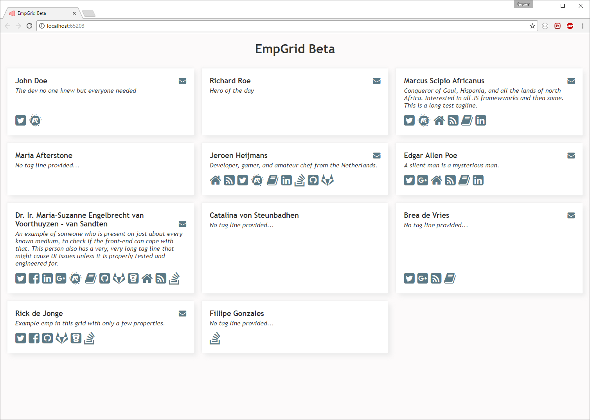

# EmpGrid

See in an instant where you can find a set of colleagues online!

## Introduction

This project's aim is to give an instant overview of what a certain group of people is up to online. More specifically, it helps you see what your colleagues' interests are. This is intended to be useful to both newcomers to a group, as well as existing members.

At the same time it is a great way to seek out what *could* be exemplary .NET Core code. As such **it might be over-engineereed** on some points, just for the sake of playing with framework features.

## Domain

A very short description of the entities in this domain:

- **Emp**: single person with interesting details
- **Grid**: a set of **Emp**s, typically arranged in grid-like layout (hence the name)
- **Medium**: any place an **Emp** can have a **Presence** (most usually online, but possibly elsewhere)
- **Presence**: the fact that an **Emp** is present on a specific **Medium**

In short: a **Grid** is a list of **Emps** with their **Presences** on various **Mediums**.

## Example

Warning: the example below might well be out of date when you view it, because this young project is still heavily in flux. It should, however, provide *some* insight to what the project is about:

## TO DO

While this project is still in flux, a simple bullet list here is preferable to GitHub issues or whatnot.

- Authentication and Authorization (in progress!)
- Craft a real logo along with a real nice favicon
- Create a real, decent, first design
- Proper layout on varying viewport sizes
- Persistence
- Import/Export
- Custom (non-gravatar) avatars for Emps
- Placeholder texts for Emps without details

Ideas for the more distant future:

- Online (?) CI setup
- Rewrite the front-end prototype to a real, enjoyable, cutting-edge framework
- Real-time updates for Mediums that require that (e.g. Twitter)
- Near-real-time updates for Mediums that require that (e.g. blog-posts, Meetup appearances)
- Multi-tenancy instead of deploy-per-grid
- Caching
- View for consolidated stream (e.g. updates from everyone together)
- Consider allowing extension of the hard-coded Mediums
